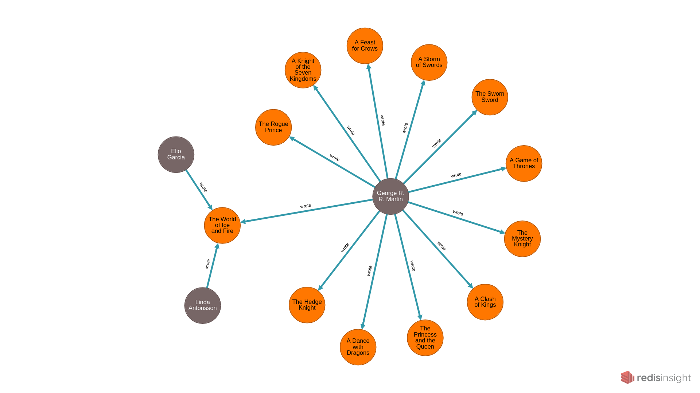
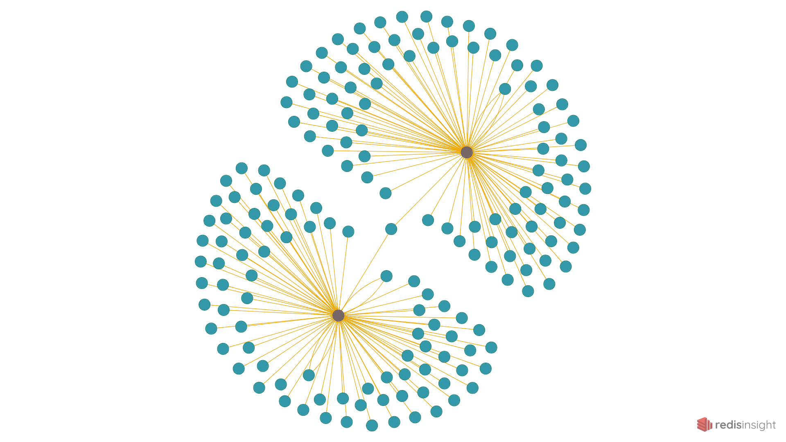

# RedisGraph Demo


## Data Set
JSON data has been converted to CSV from a public API provided at [An API of Ice and Fire](https://anapioficeandfire.com/).

Data collected from 3 endpoints have been divided in such a way that can be used to build graph nodes and relations as follows:
### Nodes:
* Book
* Writer
* Character
* House
### Relationships/Edges:
* Wrote : writer - wrote - book
* Belongs : character - belongs (to) - house

## Usage
### Options:
```bash
$ python3 bulk_insert.py --help
Usage: bulk_insert.py [OPTIONS] GRAPH

Options:
  -h, --host TEXT                Redis server host
  -p, --port INTEGER             Redis server port
  -a, --password TEXT            Redis server password
  -n, --nodes TEXT               Path to node csv file  [required]
  -r, --relations TEXT           Path to relation csv file
  -c, --max-token-count INTEGER  max number of processed CSVs to send per
                                 query (default 1024)
  -b, --max-buffer-size INTEGER  max buffer size in megabytes (default 2048)
  -t, --max-token-size INTEGER   max size of each token in megabytes (default
                                 500, max 512)
  --help                         Show this message and exit.
```

### Dependencies:
```bash
$ pip3 install click redis
```

### Migration Command:
```bash
$ python3 bulk_insert.py GOT_DEMO -n data/character.csv -n data/house.csv -n data/book.csv -n data/writer.csv -r data/wrote.csv -r data/belongs.csv

2124 nodes created with label 'b'character''
438 nodes created with label 'b'house''
12 nodes created with label 'b'book''
3 nodes created with label 'b'writer''
14 relations created for type 'b'wrote''
2208 relations created for type 'b'belongs''
Construction of graph 'GOT_DEMO' complete: 2577 nodes created, 2222 relations created in 0.156645 seconds

```

### Sample RedisGraph Query Commands:

```
GRAPH.QUERY GOT_DEMO "MATCH (w:writer)-[wrote]->(b:book) return w,b"
1) 1) "w"
   2) "b"
2)  1) 1) 1) 1) "id"
             2) (integer) 2574
          2) 1) "labels"
             2) 1) "writer"
          3) 1) "properties"
             2) 1) 1) "id"
                   2) "5e5aeb4a820126475cb09ccb"
                2) 1) "writer "
                   2) "George R. R. Martin"
       2) 1) 1) "id"
             2) (integer) 2562
          2) 1) "labels"
             2) 1) "book"
          3) 1) "properties"
             2) 1) 1) "id"
                   2) "5e5aeadb820126475cb09cbf"
                2) 1) "name"
                   2) "A Game of Thrones"
                3) 1) "isbn"
                   2) "978-0553103540"
                4) 1) "numberOfPages"
                   2) "694"
                5) 1) "publisher"
                   2) "Bantam Books"
                6) 1) "country"
                   2) "United States"
                7) 1) "released "
                   2) "1996-08-01T00:00:00"
    2) 1) 1) 1) "id"
             2) (intege
    ```

##### Note:

Reference images taken using Redis Insight, more details and installation steps can be found [here](https://redislabs.com/redisinsight/).

Listing all the writers and books.

```bash
127.0.0.1:6379> match (w:writer)-[wrote]->(b:book) return w,b
```


Finding all the characters that belong to either `House Stark of Winterfell` or `House Lannister of Casterly Rock`.


```bash
127.0.0.1:6379> match (c:character)-[belongs]->(h:house) WHERE (h.name = 'House Stark of Winterfell' OR h.name = 'House Lannister of Casterly Rock') return c,h
```


## Contributing

1.  Fork it!
2.  Create your feature branch (`git checkout -b my-new-feature`)
3.  Commit your changes (`git commit -am 'Add some feature'`)
4.  Push to the branch (`git push origin my-new-feature`)
5.  Create a new Pull Request

[Credits](https://github.com/md-farhan-memon/redis_graph_demo)
